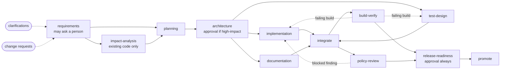

# Agentic SDLC orchestrator, with a URL shortener as its output

This repository contains two things:

- **`orchestrator/`**: a system that takes a requirement and carries it through the software delivery lifecycle (requirements, impact analysis, planning, design, implementation, tests, documentation, verification, policy review, release, promotion) using agents that run under gates, policies and human approvals.
- **`url-shortener/`**: the service the orchestrator delivered across the three scenarios. It is the reviewable outcome, checked in.

The orchestration layer is the main subject. The URL shortener is what it is exercised on.

## Run it

Requires Node.js 22.18 or newer and network access for `npm ci`.

```bash
npm run setup      # install dependencies for both packages
npm test           # type-check and unit tests: 272 for the orchestrator, 189 for the service
npm run demo       # all three scenarios and the failure demonstrations, up to about a minute
npm run test:e2e   # the same scenarios and five failure paths as assertions, 20 to 75 seconds depending on the machine
```

`npm run demo` drives the command-line interface the way a person would: it starts a run, the run stops when it needs a human, the script records a decision and resumes. The output lands in `demo-output/`:

- `demo-output/url-shortener/`: the delivered service
- `demo-output/runs/<run>/review/README.md`: the review packet for each run

A captured copy of that output is in [`evidence/`](evidence/README.md), so the results can be read without running anything.

Developed and tested on Linux: on x64 with Node.js 22.22 and on arm64 with Node.js 22.23. Nothing is platform-specific by design, but it has not been run natively on macOS or Windows.

## What the demo shows

| Run | Scenario | What happens |
| --- | --- | --- |
| `greenfield` | Build the URL shortener from a well-defined requirement | 9 tasks across three parallel lanes, 88 tests, design and release sign-off, promotion |
| `brownfield` | Add link expiry and fix a lost-clicks defect in the existing service | Impact analysis of the codebase; the first implementation fails 2 tests, the engine sends it back with the failures, the second passes all 113 |
| `ambiguous` | "Better insight into who is clicking" and "safer links" | Stops on three questions it will not guess at; a reviewer's change request at design review re-runs the affected stages; 189 tests |
| `failure-fallback` | An agent fails on every call | Bounded retries, then the fallback agent |
| `failure-no-rework` | The build fails and there is no rework budget | Roll back, stop safely |
| `failure-promote` | Promotion fails after writing to the target | Target restored from backup; a person authorizes a retry; nothing already verified is repeated |

[`docs/SCENARIOS.md`](docs/SCENARIOS.md) walks through each one.

## How it works



The engine runs this graph. Four ideas carry most of the design:

1. **Stages exchange versioned, hashed artifacts, never direct calls.** A stage declares what it consumes and produces. That is what allows a run to pause for a person, exit, and resume in a new process.
2. **Re-planning is hash comparison.** When an artifact changes, every stage that consumed the old version is reset and re-run. A stage whose inputs come out identical is reused, and so is everything downstream of it.
3. **An approval covers a hash.** A person approves exactly the content they were shown. If that content changes, the approval no longer applies and is asked for again.
4. **Agents propose; the engine disposes.** Agents return change sets. Only one stage writes them to a sandbox, only after policy checks, and only one stage writes to the real target, only after sign-off. Gates, policies and approvals are code outside the model, so no prompt reaches them.

[`docs/ARCHITECTURE.md`](docs/ARCHITECTURE.md) covers the components, the control flow and the decisions behind them.

## Offline and live mode

Each agent builds a prompt and asks a **model gateway** for a reply of a fixed shape. Two gateways implement that interface.

**Offline (default).** The gateway replays replies recorded for the scenario. The content of each agent's reply is therefore fixed in advance. Everything around it runs for real: schema validation, gates, policy rules, dependency install, type-check, the service's test suite, approvals, retries, rework and re-planning. One recording is deliberately flawed (the first brownfield implementation omits a validation rule) so that the run contains a real failing build.

**Live.** The gateway calls the Anthropic Messages API. If a call keeps failing, the stage falls back to the recording when the scenario has one.

```bash
export ANTHROPIC_API_KEY=...        # your key
export SDLC_MODEL=...               # the model id to use; there is no default
node orchestrator/src/cli.ts run --scenario scenarios/02-brownfield --target demo-output/url-shortener --mode live
node orchestrator/src/cli.ts run --requirement "Add a DELETE endpoint for links" --target demo-output/url-shortener --mode live
```

**Live mode has not been run against a real model.** It is tested against a local HTTP server that stands in for the API (`orchestrator/test/live.test.ts`), which covers the wiring, the retry-with-feedback loop and the fallback, and says nothing about the quality of a real model's output. See [limitations](docs/TESTING.md#limitations).

## Using the CLI

```bash
cd orchestrator
node src/cli.ts run --scenario ../scenarios/01-greenfield --target ../demo-output/url-shortener
node src/cli.ts status <run>
node src/cli.ts approve <run> architecture --by <your-name> --comment "..."
node src/cli.ts request-changes <run> architecture --by <your-name> --comment "..."
node src/cli.ts clarify <run> --by <your-name> --answer Q-1="..."
node src/cli.ts resume <run>
node src/cli.ts stop <run>                         # kill switch for a live run
node src/cli.ts resume <run> --retry --by <name>   # a stopped run needs a person to restart it
node src/cli.ts lineage <run> release-record       # what an artifact was derived from
node src/cli.ts graph <run>                        # the workflow with its gates and controls
node src/cli.ts audit <run>                        # verify the audit log's hash chain
node src/cli.ts metrics                            # success rate, retries, rollbacks, MTTR, latency
```

Add `--approvals interactive` to `run` or `resume` to be asked for decisions in the terminal instead of pausing. Exit codes: `0` finished, `3` waiting for a person, `4` stopped safely.

The scenarios build on each other: brownfield expects the service greenfield produced, and ambiguous expects brownfield's.

## Where things are

```
orchestrator/
  src/engine/        the scheduler: graph, state machine, artifacts, recovery, approvals
  src/governance/    audit log, policy rules, reliability metrics
  src/agents/        one agent per SDLC stage, and the schemas of what they exchange
  src/workflow/      the SDLC graph and its gates
  src/model/         model gateway: live (Anthropic) and recorded
  src/tools/         sandbox workspace, command allowlist, static code index
  src/report/        review packet
  test/              unit tests, and test/e2e for full runs
scenarios/           requirement and recordings for greenfield, brownfield, ambiguous
url-shortener/       the delivered service
evidence/            captured output of a full demo run
docs/                architecture, scenarios, testing, engineering summary
scripts/             demo and evidence capture
```

## Deliverables

| Asked for | Where |
| --- | --- |
| Working prototype, runnable end to end | `npm run demo`; `orchestrator/`, `url-shortener/` |
| Architecture overview: components, orchestration model, control flow, key decisions | [`docs/ARCHITECTURE.md`](docs/ARCHITECTURE.md) |
| Three scenarios, each showing decomposition, orchestration, validation | [`docs/SCENARIOS.md`](docs/SCENARIOS.md), [`scenarios/`](scenarios), [`evidence/`](evidence/README.md) |
| Setup instructions | This file |
| Testing approach, limitations, trade-offs | [`docs/TESTING.md`](docs/TESTING.md) |
| Final engineering summary: plan, artifacts, risks, assumptions, limitations | [`docs/ENGINEERING_SUMMARY.md`](docs/ENGINEERING_SUMMARY.md) |

## AI assistance

I built this with an AI coding assistant (Claude), which the assignment permits.

I made the top-level decisions:

- **Stack:** TypeScript on Node.js, the language I work in daily.
- **Agent model:** agents call a live model when a key is set and fall back to recorded replies otherwise, so the demo always runs and the tests are reproducible.
- **Verification:** the whole submission was run in two environments, one of them my own machine, before it was submitted.

Within those decisions, the assistant proposed the detailed design and wrote the code, the tests, the scenario recordings and the documentation.

The results of the verification runs are in `evidence/` and are reproducible with the commands above.
