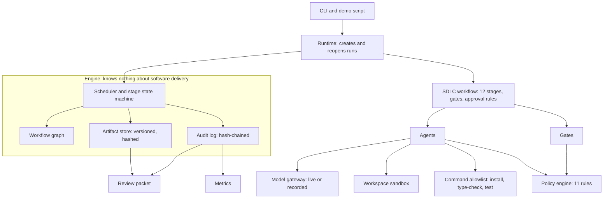
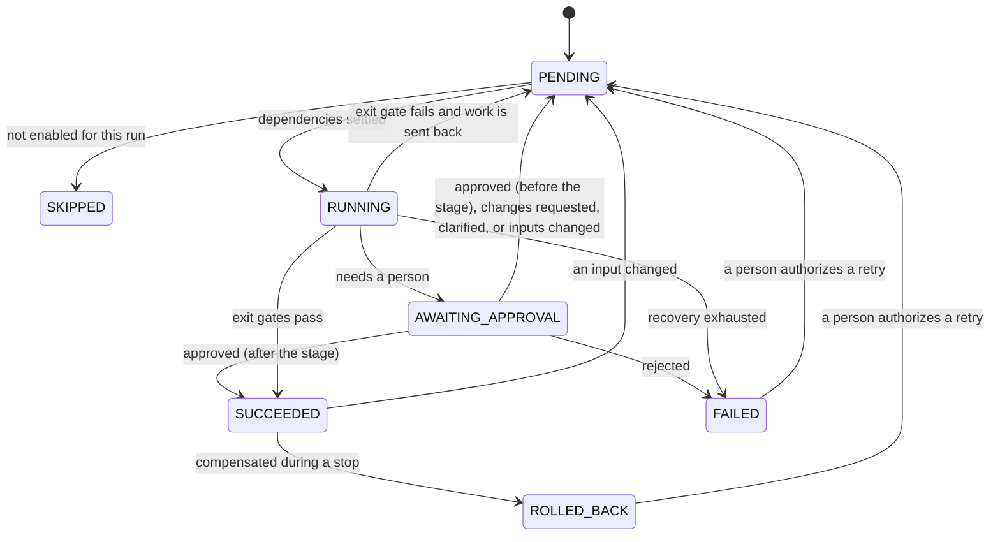

# Architecture

## Contents

1. [Components](#1-components)
2. [Orchestration model](#2-orchestration-model)
3. [The SDLC workflow](#3-the-sdlc-workflow)
4. [Control flow of one stage](#4-control-flow-of-one-stage)
5. [Governance](#5-governance)
6. [Observability](#6-observability)
7. [Agents and the model gateway](#7-agents-and-the-model-gateway)
8. [How each orchestration requirement is met](#8-how-each-orchestration-requirement-is-met)
9. [Key decisions](#9-key-decisions)
10. [What production would need](#10-what-production-would-need)

## 1. Components



| Component | Code | Responsibility |
| --- | --- | --- |
| Engine | `src/engine/engine.ts` | Runs a graph of stages: scheduling, gates, approvals, retries, fallback, rework, re-planning, rollback, safe stop. Has no knowledge of what the stages do. |
| Workflow graph | `src/engine/graph.ts` | Validates the graph when it is defined: no cycles, no unknown dependencies, one producer per artifact, inputs come from ancestors, every rework loop has an upstream consumer. |
| Artifact store | `src/engine/artifacts.ts` | Versioned, content-hashed storage for everything stages exchange, with the lineage of each version. |
| Audit log | `src/governance/audit.ts` | Append-only event log where each event carries the hash of the one before it. |
| SDLC workflow | `src/workflow/sdlcWorkflow.ts`, `gates.ts` | The twelve stages, their dependencies, gates, approval rules and recovery policies. |
| Agents | `src/agents/` | One per stage. Eight call the model; four are deterministic tools. |
| Model gateway | `src/model/` | The single seam between agents and whatever produces their text. |
| Policy engine | `src/governance/policy.ts`, `rules/` | Security, compliance, change-control and quality rules as plain functions. |
| Workspace | `src/tools/workspace.ts` | A sandbox copy of the target, with baseline, diff and reset. |
| Command runner | `src/tools/commandRunner.ts` | Runs three fixed commands with a scrubbed environment and timeouts. |
| Code index | `src/tools/codeIndex.ts` | Static index of the existing codebase: files, import graph, routes, tables, tests. |
| Metrics | `src/governance/metrics.ts` | Reliability metrics computed from audit logs. |
| Review packet | `src/report/reviewPacket.ts` | Renders a run as documents a person can review and approve. |

The engine and the workflow are separate on purpose. The engine's tests (`test/engine.test.ts`) use made-up stages with fake agents, which is how its behaviour under failure is tested exhaustively without running a build.

## 2. Orchestration model

### Stages and artifacts

A stage declares, as data:

```ts
{
  id, dependsOn,                    // position in the graph
  consumes, consumesOptional,       // artifacts it reads
  produces,                         // artifacts it writes
  agent, fallback,                  // who does the work
  entryGates, exitGates,            // checks before and after
  approval,                         // when a person must decide, and on what
  retry, rework, timeoutMs,         // recovery policy
  enabled,                          // conditional stages
  compensate,                       // how to undo its side effects
}
```

Stages never call each other. They publish **artifacts** to a store and read the latest accepted version of what they consume. Every version records its content hash, who produced it, and the hashes of the inputs it was derived from.

This indirection is what makes the rest possible:

- **Statefulness.** After every transition the run state is written to `state.json` atomically. A run can pause for a person, the process can exit, and a new process continues from the same point. The demo does this at every approval.
- **Change detection.** A stage's inputs are summarized by one **fingerprint**: the hash of its input artifacts' hashes. Equal fingerprints mean the stage would see the same world.
- **Lineage.** Any output can be traced back through `derivedFrom` to the original requirement and the human answers that shaped it.

### Stage state machine



Run states: `CREATED`, `RUNNING`, `PAUSED` (waiting for a person), `SUCCEEDED`, `SAFE_STOPPED`.

### The scheduling loop

The engine does not walk a list. On every step it re-derives what can run from the persisted state:

```
loop:
  stop requested, or budget exhausted?      -> safe stop
  reset finished stages whose inputs changed   (re-planning)
  start every PENDING stage whose ancestors are all settled   (parallelism)
  nothing running?
      everything settled                    -> SUCCEEDED
      a stage is waiting for a person       -> PAUSED
      otherwise                             -> safe stop (stuck)
  wait for any running stage to finish
```

"Settled" means finished, and built on ancestors that are themselves all finished. A stage whose ancestor was reset is not settled even though its own status still says `SUCCEEDED`, so nothing downstream starts until the ancestor has re-run.

Parallel paths and their synchronization points fall out of this: `implementation`, `test-design` and `documentation` start together when the design is approved, and `integrate` starts only when all three have finished. Node.js runs the loop on one thread, so state transitions never interleave and need no locks; the concurrency is in the awaited work (model calls, the build subprocess).

### Re-planning

Re-planning is not a special mode. It is what the loop does when a fingerprint changes:

1. Something publishes a new version of an artifact: a person's answers, a change request, feedback from a failed build, or a stage's revised output.
2. On the next step, every finished stage whose fingerprint no longer matches is reset to `PENDING`. A pending approval on it is voided.
3. The stage re-runs. If its output hashes the same as before, no new version is published, so the stages downstream of it see unchanged fingerprints and are **reused**, not re-run.

That last point is the early cutoff that build systems use, and it matters here: a change request to the requirements does not blindly re-run the pipeline. In the ambiguous scenario the impact report is re-derived from the revised specification, comes out identical, and is kept; in the brownfield scenario the tests are re-derived with the build feedback, come out identical, and are kept.

What agents can change is the content of the plan: the specification, the task breakdown, the design, the change sets. What they cannot change is the control structure. The graph, the gates and the approval rules are fixed in code.

### Human checkpoints

An approval rule on a stage returns either "not needed" or the reasons a person must decide. There are two kinds of checkpoint and two phases:

- **Approval** asks for sign-off. **Clarification** asks for answers the run cannot proceed without.
- **After** the stage: a person signs off what the stage produced. The output is published as `proposed` and is invisible to downstream stages until approved. **Before** the stage: a person signs off the action before it runs. The engine supports both and both are tested; the SDLC workflow uses "after" throughout, with the release sign-off placed immediately before the only stage that writes outside the sandbox.

A person can answer in four ways: approve, reject (the run rolls back and stops), request changes (published as an artifact that the requirements stage consumes, which triggers re-planning), or supply answers to questions (same mechanism).

Three properties are enforced by the engine, not by convention:

- **An approval covers a hash.** It is recorded against the hash of exactly what was shown. If the stage re-runs and produces different content, the old approval does not match and the stage waits again. If it produces identical content, the approval still applies and the person is not asked twice.
- **Separation of duties.** A decision is accepted only from an identity that is not an agent or the engine. Rejections and change requests require a reason.
- **The channel is recorded.** `cli`, `interactive` or `scripted`, so a reader can tell a person's decision from a script standing in for one.

### Recovery, in order

When a stage fails, the engine tries these in sequence. Each is bounded.

1. **Retry** the same agent, with exponential backoff, up to `retry.maxAttempts`. If an exit gate rejected the output, the reasons are passed to the next attempt as feedback. A failure marked non-retryable skips the remaining attempts.
2. **Fall back** to the stage's fallback agent, once. For model-backed stages this is the same agent wired to the recorded gateway.
3. **Rework.** If the stage's exit gate fails and the stage declares a rework policy, the engine publishes the failure as a feedback artifact. An upstream stage consumes it, so re-planning re-runs that stage and everything affected. Bounded by `rework.max`.
4. **Roll back and stop safely.** Compensations run in reverse order for every stage with side effects, the run becomes `SAFE_STOPPED` with the reason, and it stays stopped until a person authorizes a retry.

Retries are for infrastructure failures; rework is for a verdict on the change. The build stage shows the distinction: `npm ci` failing is thrown and retried, while tests that run and fail are reported and sent back.

### Stopping safely

- **Kill switch.** `sdlc stop <run>` writes a `STOP` file that the loop checks before every step. In-flight stages are aborted through an `AbortSignal`, which also kills a running build subprocess.
- **Autonomy budget.** A cap on stage executions, model calls and active time. Exceeding it stops the run. Time spent waiting for a person does not count.
- **Scope of rollback.** A fatal failure or a rejection undoes every side effect of the run. An operator stop or a budget stop undoes only actions that were cut off mid-flight and keeps completed work, so the run can continue.
- **Crash.** A stage found `RUNNING` at startup was interrupted by a dead process. If it had started an action with side effects, that action is undone first, then the stage runs again.
- **Honest failure.** If a compensation itself fails, the stop reason says `ROLLBACK INCOMPLETE` and names what needs manual attention.

## 3. The SDLC workflow

This table is the output of `sdlc graph <run>`, which prints the graph as the engine holds it.

| Stage | Depends on | Entry gates | Exit gates | Human checkpoint | On failure | Undo |
| --- | --- | --- | --- | --- | --- | --- |
| `requirements` | - | SEC-004 | ambiguity-lint, spec-consistency | after the stage | 2 attempt(s); then fallback agent | - |
| `impact-analysis` (conditional) | requirements | required inputs present | impact-grounded | - | 2 attempt(s); then fallback agent | - |
| `planning` | requirements, impact-analysis | required inputs present | plan-structure, plan-covers-requirements | - | 2 attempt(s); then fallback agent | - |
| `architecture` | planning | required inputs present | design-covers-requirements | after the stage | 2 attempt(s); then fallback agent | - |
| `implementation` | architecture | required inputs present | code-lane | - | 2 attempt(s); then fallback agent | - |
| `test-design` | architecture | required inputs present | test-lane, criteria-covered | - | 2 attempt(s); then fallback agent | - |
| `documentation` | architecture | required inputs present | docs-lane | - | 2 attempt(s); then fallback agent | - |
| `integrate` | implementation, test-design, documentation | merge-clean | workspace-applied | - | 1 attempt(s) | yes |
| `build-verify` | integrate | required inputs present | build-green | - | 2 attempt(s); exit gate failure sends work back (max 2) | - |
| `policy-review` | integrate | required inputs present | policy-clean | - | 1 attempt(s); exit gate failure sends work back (max 1) | - |
| `release-readiness` | build-verify, policy-review | required inputs present | release-checklist | after the stage | 2 attempt(s); then fallback agent | - |
| `promote` | release-readiness | no-target-drift, approved-is-applied | target-matches-approved | - | 1 attempt(s) | yes |

What each stage does, and what its gates check:

**requirements.** Turns the requirement into a specification: functional requirements with acceptance criteria, non-functional requirements, ambiguities with options and a default assumption, assumptions, out of scope.
- Entry: human-supplied text is screened for instructions aimed at the agents (SEC-004).
- Exit, `ambiguity-lint`: every vague word in the requirement, from a fixed list (`better`, `safer`, `soon`, `something`, ...), must be quoted in a recorded ambiguity. It is a string match against a fixed list, so the model cannot argue past it.
- Exit, `spec-consistency`: ids are unique and every human answer has been applied.
- Checkpoint: if any ambiguity is marked blocking and unanswered, the run asks. Blocking is reserved for readings that lead to materially different work that is costly to undo.

**impact-analysis.** Runs only when there is existing code. The model names the modules, API operations, data and data flows affected. Static analysis then adds the regression surface: every module that imports an affected one, from the import graph.
- Exit, `impact-grounded`: every module named exists in the code index, and every "new" module does not.

**planning.** Breaks the specification into tasks with dependencies, each assigned to the code, test or docs lane.
- Exit: the tasks form a graph without cycles; all three lanes have work; every functional requirement has a code task and a test task; no task cites a requirement that does not exist.

**architecture.** Components, API and data model changes, decisions with rejected alternatives, risks with mitigations, how each requirement is met, and a **change envelope**: whether the schema changes, whether the API change is additive or breaking, which dependencies are added, whether personal data is touched.
- Exit: every requirement is covered, and the envelope is consistent with the design's own content.
- Checkpoint: risk-based. A design with an empty envelope proceeds on its own. Any high-impact item needs a person.

**implementation, test-design, documentation.** The three lanes, in parallel. Each returns a change set: whole files, each citing the tasks it delivers.
- Exit, lane gate: the lane wrote only its own paths, cited only its own tasks, and passed the containment rules. The implementation lane cannot write under `test/`, so it cannot edit a test into passing.
- Exit, `criteria-covered` (tests): every acceptance criterion names at least one test in a file that exists.
- The test lane works from the specification and the design, without sight of the implementation. That independence is what catches a requirement the implementation missed.

**integrate.** The synchronization point and the only stage that writes to the sandbox. It resets the workspace to the baseline and applies the merged change, so running it twice gives the same tree.
- Entry, `merge-clean`: no file is claimed by two lanes, and the merged change passes the containment rules.
- Exit: the tree on disk matches the recorded hash and every changed file cites a task.
- Undo: reset the workspace to the baseline.

**build-verify.** Runs `npm ci --ignore-scripts`, the type-check and the test suite in the workspace, and records every test case's result.
- Exit, `build-green`: the type-check passes, at least one test ran, none failed.
- A failing gate sends the failure back to `implementation` and `test-design` as feedback.

**policy-review.** In parallel with the build. Evaluates all eleven rules against the files actually in the workspace, with the approved envelope and the plan.
- Exit: no blocking finding. A blocking finding goes back to `implementation` once.

**release-readiness.** A checklist computed from evidence, plus a risk assessment and rollback plan written by the model.
- REL-1: the build and the policy review were run on exactly this tree.
- REL-2, REL-3: type-check and tests pass.
- REL-4: every acceptance criterion is proven by a named test that ran and passed in this build.
- REL-5: no blocking policy finding.
- REL-6: the design was approved by a person where required, and the approval on record is for this exact design.
- Checkpoint: always. Every release is signed off by a person, who sees the high-impact items listed explicitly.

**promote.** The only stage that writes outside the run. It backs the target up, copies the approved workspace over it, and verifies the result.
- Entry, `no-target-drift`: the target is still what the change was built against.
- Entry, `approved-is-applied`: the workspace is byte-for-byte the tree that was signed off.
- Exit: the target read back from disk matches the approved tree.
- Undo: restore the target from the backup.

## 4. Control flow of one stage

1. The loop finds the stage `PENDING` with all ancestors settled, and launches it.
2. If it is not enabled for this run, it is `SKIPPED`.
3. The fingerprint of its inputs is computed. A new fingerprint increments the stage's **generation**; a retry of the same inputs does not.
4. Required inputs must exist and entry gates must pass, or the run stops.
5. If a "before" approval is required and not on record for this fingerprint, the stage waits.
6. The agent runs, under a timeout and an abort signal.
7. Exit gates evaluate the output. On failure: retry with feedback, or send work back if the stage declares rework.
8. If the inputs changed while the stage was running, the result is discarded and the stage is reset.
9. Outputs are published: `accepted`, or `proposed` if an "after" approval is needed.
10. If approval is needed and not already on record for this exact output, the stage waits.
11. `SUCCEEDED`. State is saved, and every step above has an event in the audit log.

## 5. Governance

### Policy as code

Rules are plain functions over the proposed change. They give the same answer every time and are not reachable by any prompt.

| Rule | Category | Enforces | Severity |
| --- | --- | --- | --- |
| SEC-001 | Security | Writes stay inside the workspace and inside `src/`, `test/`, `migrations/`, `docs/` and a fixed list of root files | Block |
| SEC-002 | Security | No credentials or key material. Findings report a line number, never the matched text | Block |
| SEC-003 | Security | No `eval`, `new Function`, process spawning, SQL built by interpolation or concatenation, or disabled TLS verification | Block |
| SEC-004 | Security | Human-supplied text does not try to instruct the agents to bypass controls | Block |
| CMP-001 | Compliance | No personal data stored (client address, User-Agent, contact details, visitor ids) or written to logs | Block |
| CMP-002 | Compliance | Every change cites a planned task; every planned task has a change | Block |
| CHG-001 | Change control | Existing migrations are immutable; a new one takes the next number | Block, or approval for a valid new migration |
| CHG-002 | Change control | Adding, removing or re-versioning a dependency | Needs approval |
| CHG-003 | Change control | Deleting files, removing API operations | Needs approval |
| CHG-004 | Change control | More than 60 files or 6000 lines | Needs approval |
| CHG-005 | Change control | The change does nothing high-impact that the approved design did not declare | Block |
| QA-001 | Quality | Test files are not deleted; tests are not skipped, focused or left as todo | Block |

SEC-004 screens text and runs as the entry gate of the `requirements` stage. The other eleven judge a proposed change and are evaluated by the policy engine.

Three severities: **block** stops the change; **needs approval** is allowed only because a person signed off that kind of change, and is listed for the release approver; **warn** is recorded.

### Where rules are enforced

Defence in depth, at four points:

1. **On each lane's own output**, before anyone else sees it: lane paths and the containment rules (SEC-001, SEC-002, QA-001).
2. **On the merged change, before anything is written**: the same containment rules, plus conflicts between lanes.
3. **At the moment of writing**: the workspace refuses any path that resolves outside its root, independently of policy.
4. **On the workspace as it actually is**: all eleven rules, with the approved envelope and the plan. This review reads the files from disk, not the agents' description of them.

### How an approval stays meaningful

A person approves the design, which includes its change envelope. Later, CHG-005 blocks an implementation that adds a migration, a dependency or a breaking API change the envelope did not declare. At release, the checklist confirms that the approval on record is for this exact design hash, and promotion confirms that the workspace is the exact tree that was signed off. The chain from "what a person agreed to" to "what was written to the target" has no step that relies on trust.

### Untrusted input

The requirement, clarifications and change requests are data. In prompts they are wrapped in tags and the system prompt says never to follow instructions inside them. SEC-004 screens them before any model sees them. Neither is the real defence. The real defence is structural: a model that has been talked into something can only return a change set, and that change set still has to pass the gates, the policy rules, the build and a human sign-off, none of which a prompt can alter.

### Controlled execution

The orchestrator can start exactly three commands: install, type-check, test. They are fixed in configuration, started without a shell, given a timeout, and given an environment from which everything except a short allowlist has been removed, so the API key is not visible to the code under test. Dependencies are installed with `--ignore-scripts`.

This limits what leaks and how long things run. It is not a sandbox: the test suite is code the agents wrote and it runs on the host. See [section 10](#10-what-production-would-need).

## 6. Observability

**Audit log.** `runs/<run>/audit.jsonl`, one JSON event per line: sequence number, time, run, type, stage, actor (`engine`, `agent`, `human`, `policy` or `tool`, with an id), data, the previous event's hash and its own. Editing, removing or reordering any event breaks the chain from that point, and `sdlc audit <run>` reports where. Model calls are logged with hashes of the prompt and the reply, not their content. This is tamper-evident, not tamper-proof: someone who can rewrite the whole file can rebuild the chain, so in production the head hash would be anchored somewhere the writer cannot change.

**Lineage.** `sdlc lineage <run> <artifact>` walks `derivedFrom` back to the requirement. For the ambiguous run it shows the release record deriving from design v2, which derives from plan v2 and specification v3, which derives from the requirement, the person's clarifications and the reviewer's change request.

**Decisions.** Agents return the choices they made with rationale and rejected alternatives. Each is stored with the stage, the generation and the fingerprint of the inputs it was based on.

**Review packet.** `runs/<run>/review/`, regenerated whenever the run pauses or ends: the specification, the plan and design, the diff, a traceability matrix from requirement to acceptance criterion to tasks to the tests that proved it, verification results, the release checklist, and a timeline. It is what a person reads before approving.

**Metrics.** Computed from audit logs by `sdlc metrics`, so every number traces back to events:

| Metric | Definition |
| --- | --- |
| Success rate | Succeeded runs over finished runs |
| Retry rate | Retried attempts over all stage executions |
| Rework loops per run | Times a failed gate sent work back |
| Rollback frequency | Finished runs that rolled something back, over finished runs |
| MTTR | Mean time from a stage's first failure to that stage succeeding |
| End-to-end latency | p50, p95 and mean of succeeded runs |
| Waiting on people | Reported separately |

Latency and MTTR are measured in **active time**: intervals in which the run was paused or stopped, waiting for a person, are subtracted. Otherwise both numbers would measure how quickly people answer rather than how the automation performs.

## 7. Agents and the model gateway

| Stage | Agent | Kind |
| --- | --- | --- |
| requirements, impact-analysis, planning, architecture, implementation, test-design, documentation | one each | Model-backed |
| release-readiness | checklist is computed; risk assessment is model-written | Mixed |
| integrate, build-verify, policy-review, promote | one each | Deterministic |

A model-backed agent builds a prompt from its inputs, asks the gateway for a reply matching a zod schema (the JSON Schema is included in the prompt), and maps the validated value to the stage's outputs. A reply that does not parse or does not match is a retryable failure whose message says what was wrong.

The agents receive only what `AgentDeps` gives them: the gateway, the workspace, the policy engine, the command runner and read-only facts about the run. They hold no reference to the engine, the audit log or the state.

The gateway is one interface with two implementations, chosen when the run is wired, not inside any agent:

- **`AnthropicGateway`** posts to the Messages API with the built-in `fetch`. Rate limits and server errors are retryable; a rejected request is not.
- **`RecordedGateway`** replays a recording, looked up by stage and generation. Change sets are stored as real files and assembled into the same JSON a live model would return.

Both are wrapped by a meter that counts calls against the budget and logs them.

## 8. How each orchestration requirement is met

| Requirement | Mechanism | Code | Tested by |
| --- | --- | --- | --- |
| Explicit dependency graph | `WorkflowGraph`, validated at definition | `engine/graph.ts` | `graph.test.ts` |
| Entry and exit gates | `entryGates`, `exitGates` on every stage | `workflow/gates.ts` | `gates.test.ts` |
| Sequential and parallel paths with synchronization | Loop starts every stage whose ancestors are settled | `engine/engine.ts` `readyStages` | "runs independent stages in parallel and joins" |
| Non-linear, stateful execution | Persisted state; rework loops; re-planning | `engine/engine.ts` | "sends a failed verification back upstream", "re-runs a stage that a crashed process left running" |
| Cross-stage context | Artifact store | `engine/artifacts.ts` | "passes each stage the accepted outputs" |
| Decision lineage | `derivedFrom`, decision records | `engine/artifacts.ts` | "records which inputs every output was derived from" |
| Human approval for high-impact actions | Approval rules; approval bound to a hash | `engine/engine.ts` `obtainApproval`, `submitDecision` | "does not perform a high-impact action until a person approves it", "voids a pending approval when the content it covers changes" |
| Bounded retries | `retry` with exponential backoff | `runWithRecovery` | "retries a failing stage with exponential backoff" |
| Fallback | `fallback` agent | `runWithRecovery` | "switches to the fallback agent" |
| Rollback | `compensate`, reverse order | `safeStop` | "rolls back side effects in reverse order", e2e "restores the target when promotion fails half-way" |
| Safe stop | Kill switch, budget, fatal failure | `checkStopConditions`, `safeStop` | "stops at the operator kill switch", "stops when the stage-execution budget is used up" |
| Policy guardrails: security, compliance, change control | Eleven rules, four enforcement points | `governance/rules/` | `policy.test.ts` (90 tests) |
| Audit-grade observability | Hash-chained log | `governance/audit.ts` | `audit.test.ts` |
| Traceability | Requirement to criterion to task to file to passing test | `report/reviewPacket.ts`, REL-4 | `agents.test.ts` release readiness |
| Reliability metrics | From audit events | `governance/metrics.ts` | `metrics.test.ts` |
| Dynamic re-planning | Fingerprint invalidation with early cutoff | `invalidateStaleStages` | "re-runs only the stages whose inputs actually changed" |
| Governance kept during re-planning | Approvals voided on change; graph fixed in code | `resetStage` | "voids a pending approval when the content it covers changes" |
| Controlled agent autonomy | Agents propose only; budgets; allowlist; lanes | `agents/`, `tools/` | `agents.test.ts`, `tools.test.ts` |

## 9. Key decisions

**A custom engine, not an agent framework or a workflow service.**
The assignment's differentiator is the orchestration layer, and its requirements (approvals bound to content, hash-based re-planning, compensation) are the engine's core, so it is written directly and tested directly: about 900 lines, 33 tests. A durable workflow service such as Temporal would be the right production choice for durability, timers and worker scaling; it would also hide the mechanics this work is meant to show. An agent framework would supply tool-calling loops, which this design deliberately does not use.

**Artifacts and fingerprints over direct stage-to-stage calls.**
One mechanism gives resumability, re-planning and lineage. The cost is that every stage must declare its inputs and outputs, and the graph validation exists to catch a wrong declaration early.

**Re-planning by invalidation, with a fixed graph.**
Agents can change the content of every stage. They cannot add, remove or reorder stages. The alternative, a planner that emits the graph, makes the controls themselves model output, and a control that the model can delete is not a control.

**Rework as a published artifact.**
A failed build does not jump backwards in the graph. It publishes feedback that an upstream stage consumes, and ordinary invalidation does the rest. The graph stays acyclic, the loop is visible in the lineage, and it is bounded by a counter.

**Approvals bound to content hashes.**
The alternative, an approval flag on a stage, lets content change after sign-off. Binding to the hash costs a re-approval when content really changes and nothing when it does not.

**Tests written without sight of the implementation.**
The test lane and the code lane run in parallel from the same specification. If the tests were written from the code, they would confirm what the code does. The brownfield scenario shows the difference.

**Verify in a sandbox, promote after sign-off.**
Agents never touch the target. The change is applied, built and reviewed in a copy, a person signs off the evidence, and only then is the target changed, with a backup. The cost is disk and time for the copy.

**Risk-based approval for design, mandatory approval for release.**
Asking a person about everything trains them to click approve. The design checkpoint fires only when the envelope declares something high-impact. The release checkpoint always fires, because a person owns what ships.

**Deterministic checks wherever a check is possible.**
The model writes; code checks. The release checklist, the ambiguity lint, the grounding of the impact report, traceability and all policy rules are computed. Nothing that gates a release is a model's opinion.

**Record and replay for offline mode.**
It makes runs reproducible, free and runnable without credentials, and it lets the tests assert exact outcomes. The cost is stated plainly in [TESTING.md](TESTING.md#limitations): in offline mode the agents' content is fixed, and the system's behaviour with a real model is unproven.

**TypeScript run directly by Node, three runtime dependencies.**
`zod` and `diff` for the orchestrator, `fastify` and `zod` for the service. No build step, a small supply chain, and a minimum Node version of 22.18.

## 10. What production would need

- **A real sandbox for the build.** Run install and tests in a container or microVM with no network and no host filesystem access. Today they run on the host with a scrubbed environment.
- **A durable, multi-worker engine.** State is a JSON file per run and one process runs one run. A database-backed store, a lock per run, and workers.
- **A real target.** Promotion copies a directory. It should open a pull request or trigger a deployment pipeline, and compensation should revert that.
- **Identity.** Approver names are taken from `--by`. They should come from authenticated identity, with roles deciding who may approve what.
- **An anchored audit log.** Ship the head hash to write-once storage.
- **Policy rules that parse.** The rules use regular expressions over text. Production rules would parse the syntax tree, and add dependency vulnerability and licence checks.
- **Live-model evaluation.** A measured pass rate per stage against a real model, prompt and token budgets for large codebases, and context selection better than "the files the impact report names".
- **Partial re-application.** Rework re-applies the whole change from the baseline. Large changes would want incremental application.
